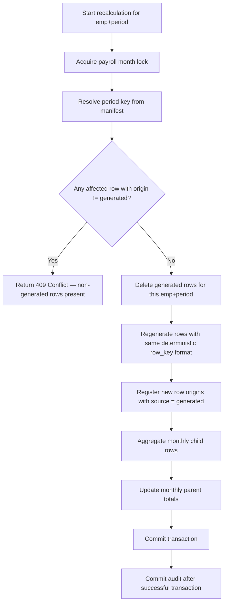

# ADR-P02: Safe Recalculation Via Row Origins — Replace Generated Rows Only

## Metadata

| Field | Value |
| --- | --- |
| ADR number | P02 |
| Scope | Payroll Subsystem |
| Status | Accepted |
| Deciders | Backend architect, payroll domain SME |
| Date | 2026-06-08 |
| Related | ADR-002 (SQL Server is the source of truth), [ADR-P01](./adr-p01-opaque-legacy-key-manifest.md) |

---

## Context

Monthly payroll recalculation must be able to regenerate calculation output for an employee-period without accidentally destroying rows that were created by manual HR payroll edits, imported from legacy data, or explicitly protected.

The legacy MS Access system did not have a concept of row origin tracking. A recalculation would typically delete all child rows for an employee-period and regenerate them from the standing profile. This works when all rows are machine-generated, but breaks when some rows have been manually adjusted post-calculation.

The new application must support:

1. **Safe recalculation**: only rows created by the application calculation engine may be replaced. Manual, imported, adjusted, and protected rows must be preserved.
2. **Idempotent row insertion**: regenerated rows must use deterministic, stable keys to prevent duplicates on retry.
3. **Conflict detection**: if a recalculation would touch a non-generated row, it must block with a 409 Conflict rather than silently deleting the row.

Three options were considered:

**Option A — Full delete-and-reinsert (legacy behavior)**: Delete all child rows for the employee-period before regenerating. Simple, but destroys manual edits.

**Option B — Merge/upsert without tracking**: Attempt to upsert rows using a deterministic key. Rows that exist but were not generated by the application are silently overwritten.

**Option C — Origin-tracked row management**: Track the origin of every monthly row in `payroll_app.monthly_row_origins`. Recalculation reads origins first and blocks if any row is not `generated`.

---

## Decision

All monthly rows written or classified by the application are registered in `payroll_app.monthly_row_origins` with an explicit `origin` value.

Recalculation may only delete or replace rows with `origin = generated`. Any other origin blocks recalculation with a 409 Conflict.

---

## Origin Classification

| Origin | Meaning | Recalculation behavior |
| --- | --- | --- |
| `generated` | Created by application calculation | May be replaced |
| `manual` | User payroll edit | Must be preserved |
| `imported-legacy` | Classified from existing legacy data | Preserved unless explicitly migrated |
| `adjusted` | Post-calculation payroll adjustment | Preserved by default |
| `protected` | System-protected row | Preserved unless override workflow exists |

---

## Deterministic Row Key Format

Every monthly row registered in `monthly_row_origins` uses a deterministic `row_key` that uniquely identifies the row within its table:

```text
{tableName}:{period}:{employeeRef}:{componentType}:{sourceKey}
```

Examples:

```text
monthly_allowance_lines:2026-05:E1001:allowance:45
monthly_benefit_lines:2026-05:E1001:benefit:33
monthly_deduction_lines:2026-05:E1001:loan:loanPayment-882
```

`row_key` is unique in `monthly_row_origins` per `(table_name, row_key)`. This prevents:

- duplicate generated rows on worker retry;
- ambiguity between a regenerated row and its predecessor.

---

## Safe Recalculation Flow



---

## Consequences

### Positive

- Manual payroll edits survive recalculation.
- Legacy-imported rows are not silently deleted.
- Duplicate row insertion on worker retry is prevented by `row_key` uniqueness.
- The 409 response gives the payroll operator a clear signal to review manual rows before recalculating.

### Negative

- Every monthly write path must register row origins.
- Recalculation cannot proceed if any non-generated row exists — the operator must explicitly migrate or protect those rows before recalculating.
- Additional SQL table and indexes required (`payroll_app.monthly_row_origins`).

### Constraints Imposed

1. Every application-written monthly row must be registered in `payroll_app.monthly_row_origins` within the same transaction.
2. Recalculation must check origins before deleting any rows.
3. Non-generated rows must never be deleted by the standard recalculation flow.
4. `row_key` format must be stable — changing the format for existing rows would break origin lookups.
5. The audit must be committed after the payroll transaction, not before.
